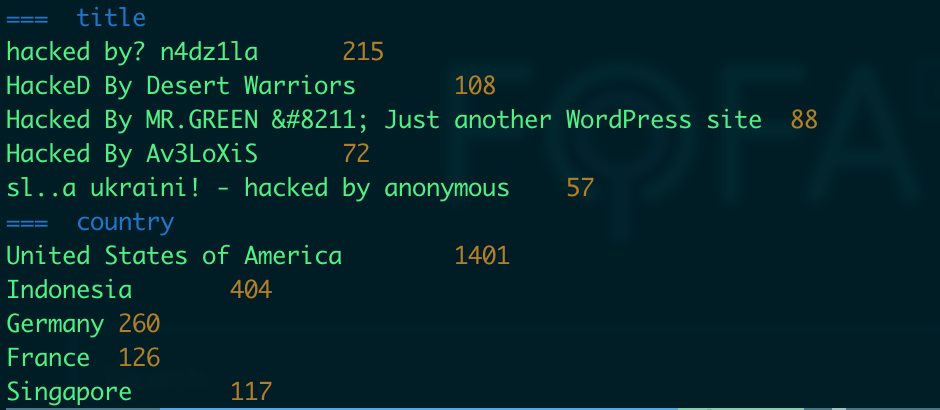

# gofofa

fofa client in Go

[](https://github.com/lubyruffy/gofofa/actions?query=workflow%3A%22Go%22)
[](https://codecov.io/gh/lubyruffy/gofofa)
[](https://github.com/LubyRuffy/gofofa/blob/main/LICENSE)
[](https://goreportcard.com/report/github.com/lubyruffy/gofofa)
[](https://www.codacy.com/gh/LubyRuffy/gofofa/dashboard?utm_source=github.com&utm_medium=referral&utm_content=LubyRuffy/gofofa&utm_campaign=Badge_Grade)
[](https://github.com/lubyruffy/gofofa/releases)
[](https://pkg.go.dev/github.com/LubyRuffy/gofofa)

## Background

The official library doesn't has unittests,  之前官方的库功能不全，代码质量差，完全没有社区活跃度，不符合开源项目的基本要求。因此，想就fofa的客户端作为练手，解决上述问题。

## Usage

### Build and run

```
~ go install github.com/LubyRuffy/gofofa/cmd/fofa@latest
~ fofa
~ FOFA_CLIENT_URL='https://fofa.info/?email=xxx@gmail.com&key=xxx' fofa search port=80
```

### Search

-   search query, only query needed:

```shell
./fofa search port=80
./fofa search 'port=80 && protocol=ftp'
```

-   search short, default subcommand is search:

```shell
./fofa domain=qq.com
```

-   custom fields, default 'ip,port':

```shell
./fofa search --fields host,ip,port,protocol,lastupdatetime 'port=6379'
./fofa search -f host,ip,port,protocol,lastupdatetime 'port=6379'
```

-   custom size, default 100:

```shell
./fofa search --size 10 'port=6379'
./fofa search -s 10 'port=6379'
```

if size is larger than your account free limit, you can set `-deductMode` to decide whether deduct fcoin automatically or not

-   custom out format, default csv:
    can be csv/json/xml, line by line

```shell
./fofa search --format=json 'port=6379'
./fofa search --format json 'port=6379'
```

-   write to file, default stdout:

```shell
./fofa search --outFile a.txt 'port=6379'
./fofa search -o a.txt 'port=6379'
```

-   fix host to url:

```shell
./fofa --size 2 --fields "host" title=Gitblit
47.92.145.232:8998
https://114.55.35.145:8443
./fofa --size 2 --fields "host" --fixUrl title=Gitblit
http://47.92.145.232:8998
https://114.55.35.145:8443
./fofa --size 2 --fields "host" --fixUrl title=Gitblit
```
use another url prefix:
```shell
./fofa --size 1 --fields "host" --fixUrl --urlPrefix "redis://" protocol=redis
redis://152.136.145.87:6379
```

-   verbose mode

```shell
./fofa --verbose search port=80
```

-   pipeline to nuclei

```shell
./fofa -fields "host" -fixUrl 'app="Aspera-Faspex"' | nuclei -t http/cves/2022/CVE-2022-47986.yaml
```

-   uniq by ip

```shell
./fofa --fixUrl --size 1000 --fields host --uniqByIP 'host="edu.cn"'
```

### Stats

-   stats subcommand

```shell
./fofa stats --fields title,country title="hacked by"
```


### Icon

-   icon subcommand

search icon at fofa:

```shell
./fofa icon --open ./data/favicon.ico
./fofa icon --open https://fofa.info/favicon.ico
./fofa icon --open http://www.baidu.com
```

calc local file icon hash:

```shell
./fofa icon ./data/favicon.ico
```

calc remote icon hash:

```shell
./fofa icon https://fofa.info/favicon.ico
```

calc remote homepage icon hash:

```shell
./fofa icon http://www.baidu.com
```

### Host

-   host subcommand

```shell
./fofa host demo.cpanel.net
Host:            demo.cpanel.net
IP:              208.74.120.133
ASN:             33522
ORG:             CPANEL-INC
Country:         United States of America
CountryCode:     US
Ports:           [2078 3306 2079 2082 143 993 2086 2095 2083 2087 110 2080 80 995 2096 2077 443]
Protocols:       imaps,mysql,https,imap,pop3s,http,pop3
Categories:      Server Management
Products:        cPanel-MGMT-Products
UpdateTime:      2022-05-30 17:00:00
```

### Dump

-   dump large-scale data

```shell
./fofa dump --format json -fixUrl -outFile a.json -batchSize 10000 'title=phpinfo'
```

-   dump large-scale data by queries file (line by line)

```shell

cat queries.txt
port=13344
port=23455

# csv
./fofa dump -outFile out.csv -inFile queries.txt

# json
./fofa dump -inFile queries.txt -outFile out.json -j
2023/08/09 10:05:33 dump data of query: port=13344
2023/08/09 10:05:35 size: 11/11, 100.00%
2023/08/09 10:05:35 dump data of query: port=23455
2023/08/09 10:05:37 size: 499/499, 100.00%
```

### Domains

-   domain subcommand 主要用于最简单的拓线

add domains mode to extend domains from domain, through certs
```shell
fofa domains -s 1000 -withCount baidu.com
baidu.com       660
dwz.cn  620
dlnel.com       614
bcehost.com     614
bdstatic.com    614
......
......
```

withCount mean with domain count value, you can also use `-uniqByIP` to uniq by ip:
```shell
fofa domains -s 1000 -withCount -uniqByIP baidu.com 
baidu.com       448
dwz.cn  410
aipage.cn       406

```

### Utils

-   random subcommand

random generate date from fofa, line by line
```shell
./fofa random
./fofa random -f host,ip,port,lastupdatetime,title,header,body --format json
```

every 500ms generate one line, never stop

```shell
./fofa random -s -1 -sleep 500
```

-   count subcommand

```shell
./fofa count port=80
```

-   account subcommand

```shell
./fofa account
```

-   version

```shell
./fofa --version
```

## Features

-   ☑ Cross-platform
    -   ☑ Windows
    -   ☑ Linux
    -   ☑ Mac
-   ☑ Code coverage > 90%
-   ☑ As SDK
    -   ☑ Client: NewClient
        -   ☑ HostSearch
        -   ☑ HostSize
        -   ☑ AccountInfo
        -   ☑ IconHash
        -   ☑ support cancel through SetContext
-   ☑ As Client
    -   ☑ Sub Commands
        -   ☑ account
        -   ☑ search
            -   ☑ query
            -   ☑ fields/f
            -   ☑ size/s
            - group/g 根据字段聚合：group by ip 根据ip合并，比如查询一个app会有很多域名，其中多个域名对应一个ip，这时只测试其中一个就好了
            -   ☑ fixUrl build valid url，默认的字段如果是http的话前面没有http://前缀，导致命令行一些工具不能使用，通过这个参数进行修复
              -   ☑ can use with urlPrefix, such as use `app://` instead of `http://`
              -   ☑ support socks5
              -   ☑ support redis
            -   ☑ full 匹配所有，而不只是一年内的
            -   ☑ format
                -   ☑ csv
                -   ☑ json
                -   ☑ xml
                -   ☐ table
                -   ☐ excel
            -   ☑ outFile/o
        -   ☑ stats
        -   ☑ icon
        -   ☐ web
        -   ☑ dump https://en.fofa.info/api/batches_pages large-scale data retrieval
        -   ☑ domains
    -   ☑ Terminal color 
    -   ☑ Global Config
        -   ☑ fofaURL
        -   ☑ deductMode
    -   ☑ Envirement
        -   ☑ FOFA_CLIENT_URL format: <url>/?email=\<email\>&key=\<key\>&version=\<v1\>
        -   ☑ FOFA_SERVER
        -   ☑ FOFA_EMAIL
        -   ☑ FOFA_KEY
-   ☐ Publish
    -   ☑ github
    -   ☐ brew
    -   ☐ apt
    -   ☐ yum


## Scenes

### How to dump all domains that cert is valid and contains google?

```shell
./fofa stats -f domain -s 100 'cert.is_valid=true && (cert="google")'
```
